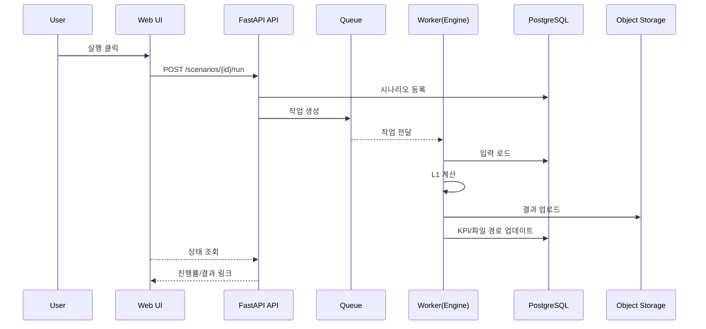
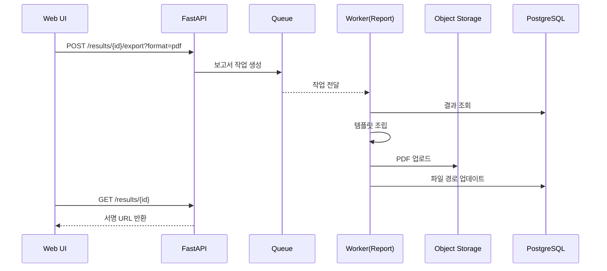
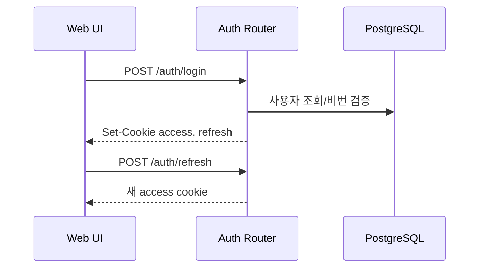
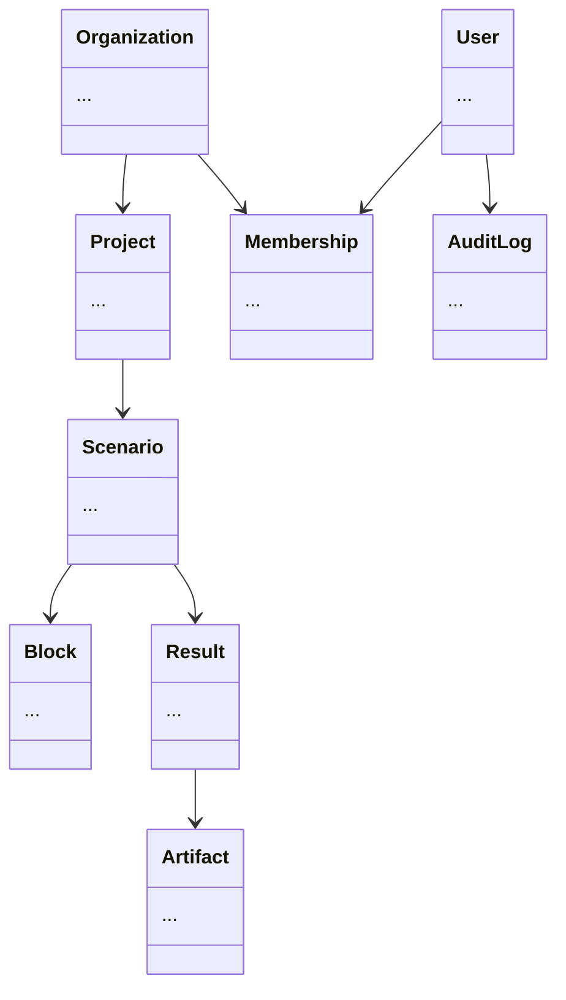

# AquaNova Wave Pro 시뮬레이터 — 아키텍처 설계서 v1.0 (Final)

---

## 0. 아키텍처 원칙

1. **단순→확장**: L1은 단순 구조, L2는 플러그인 방식 확장
2. **분리**: API와 시뮬레이션 엔진(Worker) 분리, 비동기 처리
3. **관측성**: 로그/메트릭/트레이스 기본 탑재(OpenTelemetry)
4. **보안 우선**: JWT(httpOnly), CSRF, RBAC, 최소 권한
5. **테넌시**: 조직 단위 멀티테넌시, 감사 추적

---

## 1. 시스템 구성도

### 1.1 컨텍스트 다이어그램

```mermaid
flowchart LR
  User[사용자 (브라우저)] --> FE[웹 UI (React/SPA)]
  FE -->|REST/JSON| API[FastAPI 백엔드]
  API --> DB[(PostgreSQL)]
  API --> OBJ[(S3 호환 스토리지)]
  API --> Q[작업 큐 (Redis/RabbitMQ)]
  Q --> WRK[Worker(시뮬엔진/PDF)]
  WRK --> DB
  WRK --> OBJ
  API --> OBS[(Prometheus/Loki/Tempo)]
  FE --> CDN[(CDN/Static Host)]
```

### 1.2 컴포넌트

- **웹 UI**: React, React Flow, Axios, 상태관리
- **API**: FastAPI, 모듈형 라우터, 인증/권한, 입력 검증, 시뮬 트리거
- **시뮬 워커**: Celery/RQ, L1 엔진(NumPy), L2 플러그인
- **저장소**: PostgreSQL, S3(MinIO)
- **큐/브로커**: Redis(RQ, 초기), RabbitMQ(확장)
- **관측성**: Prometheus, Loki, Tempo, Grafana
- **경계**: 외부 인증(SSO/OIDC, 미포함), 외부 파일 스토리지, 메일 발송

---

## 2. 배포 구성

- **개발/운영**: Docker Compose (api, worker, db, redis, minio, grafana)
- **서비스 운영**: 단일/소수 서버, systemd 관리, Nginx(HTTPS/HTTP2)
- **네트워크**: 내부 IP, 포트 제한, 외부 노출 최소화
- **스토리지**: PostgreSQL(메타데이터), MinIO(S3 호환)
- **백업**: pg_dump 야간 스냅샷(일 1회), MinIO 버저닝, 30일 보관
- **스케일링**: 컨테이너 수평 확장(단일 호스트)
- **모니터링**: Grafana 스택(Prometheus/Loki/Tempo)

---

## 2.5 백업/복구 정책

- **RPO/RTO**: RPO 24h, RTO 2h
- **DB**: pg_dump 일 1회 + 주 1회 풀 스냅샷 + 월 1회 오프사이트(암호화)
- **MinIO**: 버킷 버전관리, 삭제보호, 30일 롤링 + 월간 스냅샷 12개월
- **복구 리허설**: 월 1회 자동화 스크립트로 검증
- **암호화**: TLS + AES-256 서버측 암호화
- **모니터링**: 백업 성공/실패 및 용량 임계치 알림

---

## 3. 보안/권한

- **CORS**: origin whitelist, Credentials 허용, 메서드/헤더 제한
- **HSTS**: max-age=31536000; includeSubDomains; preload
- **CSP**: `default-src 'self'; img-src 'self' data:; script-src 'self'; style-src 'self' 'unsafe-inline'; connect-src 'self'; frame-ancestors 'none'`
- **X-Content-Type-Options**: nosniff, **X-Frame-Options**: DENY, **Referrer-Policy**: no-referrer
- **Rate Limit**: 10 req/s/IP, 로그인 5회/분, 429 응답 시 Retry-After
- **쿠키**: httpOnly, Secure, SameSite=Lax, CSRF 더블서브밋
- **세션**: 이메일+비밀번호, JWT Access/Refresh 쿠키
- **RBAC**: Owner/Admin/Editor/Viewer (조직/프로젝트)
- **감사로그**: 주요 변경/내보내기/권한 변경 기록

---

## 4. 주요 유스케이스 시퀀스

### 4.1 시나리오 실행



### 4.2 PDF 보고서 내보내기



### 4.3 로그인/토큰 갱신



---

## 5. ERD (개체-관계)

- Organization(1) — (N) Project(1) — (N) Scenario(1) — (N) Block
- Scenario(1) — (N) Result; Result(1) — (N) Artifact
- User(N) — Membership — (N) Organization
- AuditLog, InviteToken, RefreshToken



- 모든 ID: UUIDv7
- `graph_json`: 노드/엣지/메타 포함(JSON Schema)
- `kpi_json`: flow/feed/permeate/concentrate, tds, ph, recovery, flux, ndp, sec 등

---

## 5.4 CSV 레퍼런스 포맷

### 막 스펙 CSV (`membranes.csv`)

```
membrane_id,vendor,model,type,active_area_m2,A_LMH_per_bar,B_LMH,salt_rejection_pct,max_pressure_bar,max_temp_C,ph_min,ph_max
RO-8040-01,ExampleCo,XLE-4040,RO,7.9,5.2,0.12,99.2,25,45,2,11
NF-8040-01,ExampleCo,NF90-4040,NF,7.0,6.0,0.35,97.0,20,45,2,11
```

### 펌프 커브 CSV (`pump_curves.csv`)

```
pump_id,vendor,model,rpm,flow_m3h,head_bar,efficiency_pct,power_kW
HP-50-01,PumpCorp,HP50,2900,5.0,22.0,62,4.1
HP-50-01,PumpCorp,HP50,2900,7.5,20.5,66,4.5
HP-50-01,PumpCorp,HP50,2900,10.0,18.8,70,5.2
```

---

## 6. API 설계

- `/auth/*` 로그인/갱신/로그아웃
- `/projects/*` CRUD, 멤버 관리
- `/scenarios/*` CRUD, 실행(run), 상태 조회
- `/results/*` 조회, 내보내기(export)

| 엔드포인트                | 설명                       |
|--------------------------|----------------------------|
| POST /scenarios/{id}/run | 시뮬 실행, job_id 반환      |
| GET /scenarios/{id}/status | 상태/진행률/ETA           |
| GET /results/{id}        | KPI + artifacts            |
| POST /results/{id}/export?format=pdf | PDF 내보내기 |

- 오류: Problem+JSON(RFC7807), trace_id 포함

| 코드  | 의미     | 예시                      |
| --- | ------ | ----------------------- |
| 400 | 잘못된 요청 | 파라미터 오류, JSON 스키마 위반 |
| 401 | 인증 필요  | 토큰 없음/만료                |
| 403 | 권한 없음  | RBAC 위반                     |
| 404 | 없음     | 리소스 미존재                 |
| 409 | 충돌     | 중복 이름, 실행 중 중복 트리거 |
| 422 | 검증 실패  | 그래프/물리 제약 위반          |
| 429 | 과도한 요청 | 레이트리밋 초과                |
| 500 | 서버 오류  | 예기치 못한 오류               |

---

## 7. 내부 모듈 구조

```
app/
  core/
    config.py            # pydantic-settings, ENV
    security.py          # JWT, CSRF, pwd hashing(Argon2)
    logging.py           # 구조화 로그, request_id
    deps.py              # Depends (db/session, current_user, org_scoped)
  db/
    base.py              # SQLAlchemy engine/session
    models/              # typed ORM
      user.py, organization.py, project.py, scenario.py, block.py, result.py, artifact.py, membership.py, audit.py
    schemas/             # Pydantic v2 I/O 모델
    migrations/          # Alembic
  api/
    routers/
      auth.py, projects.py, scenarios.py, results.py, files.py
    dependencies.py
  services/
    sim_engine/          # L1 모델(NumPy), L2 플러그인 구조
    tasks.py             # run_simulation, export_pdf 등
    reporting.py         # PDF 템플릿/그래프
    storage.py           # S3 래퍼
    mailer.py            # 통지(선택)
  main.py                # FastAPI 앱 팩토리/미들웨어
  middleware.py          # CORS, gzip, rate-limit hook(선택)
```

---

## 8. 설정/비밀

- 주요 필드: DATABASE_URL, REDIS_URL, S3_ENDPOINT/KEY/SECRET/BUCKET, JWT_SECRET/EXPIRE, CSRF_SECRET, RATE_LIMIT
- 프로필: dev/stage/prod, `.env` + ENV 우선

---

## 8.5 보고서 템플릿 & i18n

- 브랜딩: 로고/컬러, 표지/머리말/바닥글 스타일
- 폰트: Noto Sans(KR/EN)
- 레이아웃: 표지 → 다이어그램 → 요약표 → 스트림별 표 → KPI/그래프
- 다국어: 한국어/영문 토글, JSON 키-값 관리

예시 키셋(JSON):

```
{
  "report.title": "시뮬레이션 보고서",
  "report.cover.scenario": "시나리오",
  "report.cover.date": "날짜",
  "section.diagram": "다이어그램",
  "section.summary": "요약",
  "section.streams": "스트림별 표",
  "kpi.recovery": "회수율",
  "kpi.flux": "플럭스",
  "kpi.ndp": "순구동압",
  "kpi.sec": "특정에너지"
}
```

---

## 9. 관측성

- **로그**: JSON, request_id, user_id, org_id, job_id
- **메트릭**: 요청 지연, 작업 시간, 실패율, 단계별 타이머
- **트레이스**: FE→API→Worker→DB/S3 연동

---

## 10. 성능/스케일링

- 동시 사용자 20, 동시 시뮬 잡 4 (Worker=4)
- API: HPA/수평 확장, P95 < 300ms, p99 < 800ms
- 시뮬: L1 기준 100k step ≤ 10s, 타임아웃 15분, 재시도 3회
- 리소스: API 0.5–1 vCPU / 512MB RAM, Worker 2 vCPU / 2–4GB RAM
- 멱등성: Idempotency-Key 헤더 지원
- 대용량 업로드: 100MB 이하, 멀티파트/스트리밍
- S3 업로드: 결과 스트리밍, DB에는 메타만

---

## 11. 시뮬레이션 엔진(L1)

- 입력: 그래프(JSON), 블록 파라미터, 단위계
- 처리: 블록별 질량/에너지 수지 연쇄 계산
- 출력: 스트림별 Flow/TDS/pH/Pressure, KPI
- 확장: L2 플러그인, CCRO 루프 파서 분리

---

## 12. 테스트 전략

- 단위: 모델 수식 검증, API 스키마/권한
- 통합: 시나리오→실행→결과→보고서 E2E
- 회귀: KPI 기준값 ±5% 어서션

---

## 12.5 보안 테스트 & 컴플라이언스

- SAST: ruff, mypy, bandit, semgrep, secret scan, pip-audit/Safety
- 컨테이너: Trivy
- DAST: OWASP ZAP baseline(주 1회)
- SBOM/라이선스: CycloneDX, NOTICE/3rd_party_licenses.txt
- 폰트/에셋: Noto Sans(SIL OFL 1.1)
- 취약점 SLA: High=7일/Medium=30일 내 수정
- 아티팩트 보관: 보안리포트/SBOM S3에 365일 보관

---

## 13. ADR (Architecture Decision Records)

| 번호      | 내용/결정                                      |
|-----------|-----------------------------------------------|
| ADR-001   | 인증: JWT(httpOnly), SSR/SPA 혼용, 보안/편의   |
| ADR-002   | 큐: Redis(RQ)→간단, RabbitMQ 전환 가능성       |
| ADR-003   | 스토리지: S3 호환, 파일 서버 복잡도 제거       |
| ADR-004   | ID: UUIDv7, 시간 정렬/중복 위험 감소           |

---

## 14. 위험/대응

- 모델 검증 데이터 부족 → 샘플 제공
- 장시간 작업 과부하 → 큐/워커 확장, 요청량 보호
- 다중 테넌트 데이터 격리 → org_id 스코프 강제

---

## 15. 로드맵 연결

| 단계 | 주요 기능                       |
|------|---------------------------------|
| M1   | Editor + L1 + Export CSV/XLSX   |
| M2   | CCRO L1 + PDF Export + KPI 보강 |
| M3   | 멀티테넌시/RBAC + 비교 + L2 베타|

---

## 16. 검토/확정 필요 항목

- [x] 브로커: Redis(RQ)
- [x] 배포: 온프레미스/로컬 서버(Docker Compose + Nginx + MinIO)
- [x] PDF 템플릿: 브랜딩/폰트/레이아웃/i18n 확정
- [x] SSO(OIDC): 초기 미포함
- [x] CSV 스펙: 막/펌프 포맷 확정
- [x] 백업 장기 보관: 주간 8개 / 월간 12개(오프사이트 암호화)
- [x] 보안 스캔 보관: 보안리포트/SBOM 365일 보관(S3)
- [x] 라이선스/법무: 상용(비공개), 폰트 OFL 고지, NOTICE/SBOM 포함

---

## 17. 운영 Runbook (요약)

### 17.1 백업

- DB: `pg_dump -Fc $DB_URL > backups/db_$(date +%F).dump`
- MinIO: 버킷 버전관리 + 월간 스냅샷(미러링 스크립트)

### 17.2 복구 테스트

- DB: `pg_restore -d $DB_URL backups/db_YYYY-MM-DD.dump`
- 결과 파일: S3 경로에서 샘플 아티팩트 복원 후 보고서 열람 확인

### 17.3 워커 스케일/재시작

- 스케일: `docker compose up -d --scale worker=4`
- 로그: `docker compose logs -f api worker`

### 17.4 보안 스캔

- CI 실패 시 리포트 확인: `s3://reports/security/YYYY/MM/`
- SBOM 확인: `s3://reports/sbom/YYYY/MM/`

### 17.5 비밀/키 교체

- `.env`/KMS 갱신 → Compose 재기동 → 구 키 폐기 기록(AuditLog)

---

## 부록 A) .env 샘플

```
DATABASE_URL=postgresql+psycopg://user:pass@db:5432/aquanova
REDIS_URL=redis://redis:6379/0
S3_ENDPOINT=http://minio:9000
S3_ACCESS_KEY=MINIO_ACCESS_KEY
S3_SECRET_KEY=MINIO_SECRET_KEY
S3_BUCKET=an-results
JWT_SECRET=change_me
CSRF_SECRET=change_me
RATE_LIMIT=10
```

## 부록 B) CSP 예시(nginx)

```
add_header Content-Security-Policy "default-src 'self'; img-src 'self' data:; script-src 'self'; style-src 'self' 'unsafe-inline'; connect-src 'self'; frame-ancestors 'none'" always;
add_header X-Frame-Options "DENY" always;
add_header X-Content-Type-Options "nosniff" always;
add_header Referrer-Policy "no-referrer" always;
```