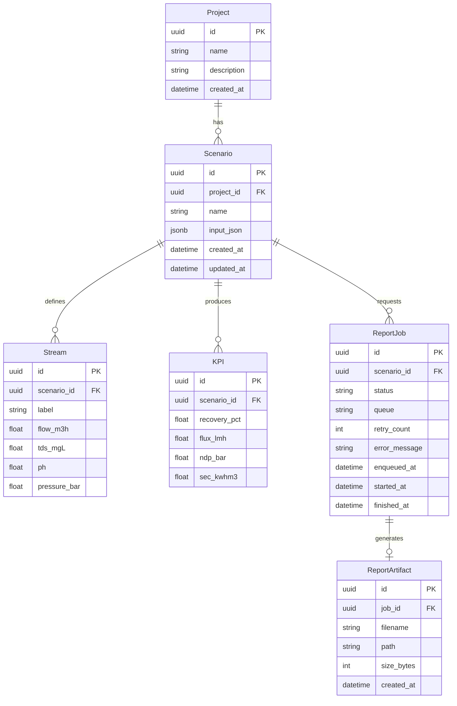
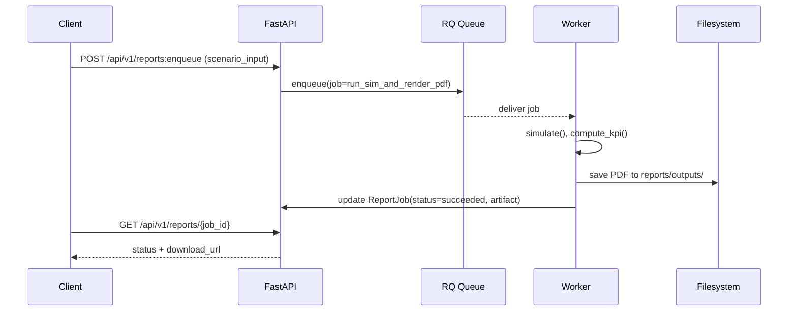

# 03. Architecture (Draft)

> AquaNova — FastAPI 정석 패턴 · 로컬 배포 · PDF 리포트 · Redis RQ 비동기

---

## 1. 도메인 모델 & ERD

핵심 엔터티와 관계 정의:



| Table             | Key Columns                                                         | Notes      |
| ----------------- | ------------------------------------------------------------------- | ---------- |
| `project`         | `id`(UUID), `name`                                                  | 상위 그룹      |
| `scenario`        | `id`, `project_id`, `input_json`                                    | 입력 스냅샷 저장  |
| `stream`          | `scenario_id`, `label`, `flow_m3h`, `tds_mgL`, `ph`, `pressure_bar` | 결과 스트림 표준화 |
| `kpi`             | `scenario_id`, `recovery_pct`, `flux_lmh`, `ndp_bar`, `sec_kwhm3`   | KPI 요약     |
| `report_job`      | `status`, `retry_count`, 시간 컬럼                                      | RQ 작업 상태   |
| `report_artifact` | `job_id`, `filename`, `path`                                        | 생성된 PDF 파일 |

---

## 2. 시뮬레이션 I/O 계약 (Pydantic v2)

### 입력(JSON)

```json
{
  "project_id": "11111111-1111-1111-1111-111111111111",
  "scenario_name": "RO_2Stage_A",
  "feed": { "flow_m3h": 20.0, "tds_mgL": 2500, "temperature_C": 25.0, "ph": 7.2 },
  "stages": [
    {
      "type": "RO",
      "elements": 6,
      "pressure_bar": 15.0,
      "recovery_target_pct": 45.0
    },
    {
      "type": "RO",
      "elements": 4,
      "pressure_bar": 14.0,
      "recovery_target_pct": 75.0
    }
  ],
  "options": { "antiscalant": true, "energy_recovery": false }
}
```

### 출력(JSON)

```json
{
  "scenario_id": "22222222-2222-2222-2222-222222222222",
  "streams": [
    { "label": "Feed",    "flow_m3h": 20.0, "tds_mgL": 2500, "ph": 7.2, "pressure_bar": 1.0 },
    { "label": "Permeate", "flow_m3h": 9.0,  "tds_mgL": 50,   "ph": 6.9, "pressure_bar": 0.8 },
    { "label": "Brine",    "flow_m3h": 11.0, "tds_mgL": 4300, "ph": 7.4, "pressure_bar": 16.0 }
  ],
  "kpi": { "recovery_pct": 45.0, "flux_lmh": 18.5, "ndp_bar": 8.2, "sec_kwhm3": 3.2 }
}
```

### 에러 모델

| code                 | message  | details      |
| -------------------- | -------- | ------------ |
| `INVALID_INPUT`      | 잘못된 파라미터 | 필드/범위 검증 실패  |
| `NUMERIC_DIVERGENCE` | 수치 발산    | 경계조건/수치해석 실패 |
| `MISSING_PROPERTIES` | 물성치 부족   | 온도/점도 등 부재   |

---

## 3. PDF 리포트 레이아웃

### 섹션

1. **Cover**: 로고, 시나리오명, 생성일
2. **System Summary**: Pass/시스템 요약 표
3. **Diagram (thumbnail)**: 공정 다이어그램 축소본
4. **Streams Table**: Flow/TDS/pH/Pressure
5. **KPI Summary & Charts**: Recovery/Flux/NDP/SEC 그래프

### 브랜딩 토큰

- **Colors**: `primary`, `secondary`
- **Font**: *Noto Sans* (KR/EN)
- **Grid**: A4 여백/행간/표 스타일

### 템플릿 모듈

- `reports/templates/cover.py`
- `reports/templates/summary.py`
- `reports/templates/diagram.py`
- `reports/templates/streams.py`
- `reports/templates/kpi.py`

---

## 4. 비동기 작업 플로우 (Redis RQ)



- 실패/재시도: 기본 3회(지수 백오프), 타임아웃 300s  
  `INVALID_INPUT`은 즉시 실패, `NUMERIC_DIVERGENCE`는 1회 재시도

---

## 5. API 표 (초안)

| Method | Path                                | Purpose      | Req     | Res                |
| ------ | ----------------------------------- | ------------ | ------- | ------------------ |
| `POST` | `/api/v1/simulations:run`           | 단발성 시뮬레이션 실행 | 입력 JSON | 결과 JSON            |
| `POST` | `/api/v1/reports:enqueue`           | PDF 생성 작업 큐잉 | 입력 JSON | `{job_id}`         |
| `GET`  | `/api/v1/reports/{job_id}`          | 작업 상태 조회     | -       | `status, artifact` |
| `GET`  | `/api/v1/reports/{job_id}/download` | PDF 다운로드     | -       | PDF 파일             |
| `POST` | `/api/v1/auth/login`                | JWT 쿠키 로그인   | id/pw   | 204                |

### OpenAPI 스니펫

```yaml
paths:
  /api/v1/reports:enqueue:
    post:
      requestBody:
        required: true
        content:
          application/json:
            schema: { $ref: '#/components/schemas/ScenarioInput' }
      responses:
        '200':
          description: OK
          content:
            application/json:
              schema:
                type: object
                properties: { job_id: { type: string, format: uuid } }
```

---

## 6. 구성/환경 (pydantic-settings)

| Key             | Example                       | Description |
| --------------- | ----------------------------- | ----------- |
| `APP_ENV`       | `local`                       | 실행 환경       |
| `DB_URL`        | `postgresql+psycopg://...`    | DB 연결       |
| `REDIS_URL`     | `redis://localhost:6379/0`    | RQ 큐        |
| `REPORT_DIR`    | `reports/outputs`             | PDF 저장 경로   |
| `BRAND_PRIMARY` | `#0a7cff`                     | 브랜드 컬러      |
| `FONT_PATH`     | `/fonts/NotoSans-Regular.ttf` | 폰트 경로       |

---

## 7. 레이어드 구조 (FastAPI 정석)

```
app/
  api/v1/            # 라우팅
  services/          # 비즈니스 로직 (시뮬레이션/리포팅)
  db/models/         # ORM 모델
  core/              # 설정/보안/DI
  workers/           # RQ 워커 엔트리
```

- **DI**: Depends로 서비스/세션 주입
- **ORM**: SQLAlchemy 2.0 Typed + Annotated 타입 힌팅
- **트랜잭션**: 유닛오브워크 패턴(선택)

---

## 8. 테스트 전략

- **단위**: services.simulation 수치 검증, 템플릿 렌더러 표 구조 검증
- **API**: FastAPI TestClient로 I/O 계약 검증
- **E2E**: RQ 워커 포함 end-to-end로 PDF 생성까지 확인

---

## 9. 초기 작업 체크리스트

- [ ] alembic init + 기초 마이그레이션
- [ ] Pydantic v2 스키마: ScenarioInput, ScenarioOutput
- [ ] /reports:enqueue 라우터 스텁 + 워커 잡 함수
- [ ] 템플릿 모듈 파일 생성 및 빈 구현
- [ ] .env.example 정리 + docker-compose.yml(api, db, redis, worker)

---

### 부록 A: Pydantic 모델 스텁

```python
# app/api/v1/schemas.py
from pydantic import BaseModel, Field
from typing import List, Optional
from uuid import UUID

class Stage(BaseModel):
    type: str
    elements: int
    pressure_bar: float
    recovery_target_pct: float

class Feed(BaseModel):
    flow_m3h: float
    tds_mgL: float
    temperature_C: float
    ph: float

class ScenarioInput(BaseModel):
    project_id: UUID
    scenario_name: str
    feed: Feed
    stages: List[Stage]
    options: dict = Field(default_factory=dict)

class StreamOut(BaseModel):
    label: str
    flow_m3h: float
    tds_mgL: float
    ph: float
    pressure_bar: float

class KPIOut(BaseModel):
    recovery_pct: float
    flux_lmh: float
    ndp_bar: float
    sec_kwhm3: float

class ScenarioOutput(BaseModel):
    scenario_id: UUID
    streams: List[StreamOut]
    kpi: KPIOut
```

### 부록 B: 워커 잡 시그니처

```python
# app/workers/report_worker.py
from uuid import UUID

def run_sim_and_render_pdf(scenario_input: dict) -> dict:
    """시뮬레이션 수행 후 PDF 렌더링, artifact 메타데이터 반환."""
    ...
```